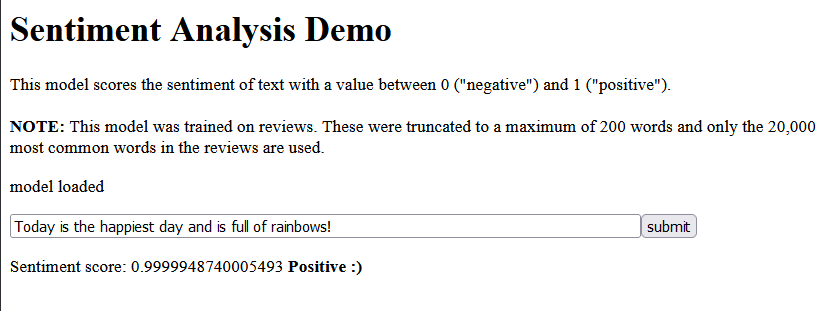

# SentimentAnalysis

This model scores the sentiment of text with a value between 0 ("negative") , 0.5 ("neutral")  up to 1 ("positive"). This model was trained on reviews. These were truncated to a maximum of 200 words and only the 20,000 most common words in the reviews are used.

My JSFiddle: https://jsfiddle.net/tripwireza/kdx158u0/13/

